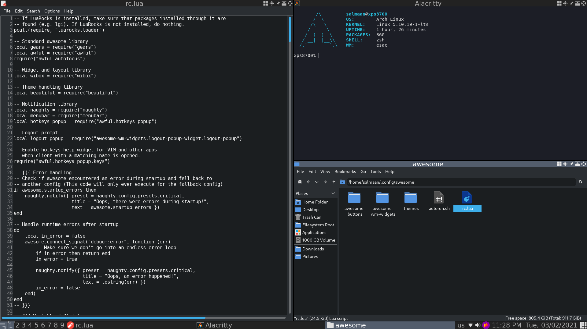

# About
Here is the configuration to Awesome window manager. Awesome WM's documentation is confusing if you do not know what you are looking for. I craeted this configuration to help get you familiar to Awesome WM and the Lua programming language. I listed the programs I use so all the shortcuts to that program work out of the box. 

## Screenshot


## Awesome WM config location:
~/.config/awesome/rc.lua

## autostart programs script location:
~/.config/aweosme/autorun.sh

## Add logout launcher from streetturtle's repostory called awesome-wm-widgets:
```
cd ~/.config/awesome/
git clone https://github.com/streetturtle/awesome-wm-widgets
git clone https://github.com/streetturtle/awesome-buttons
```

## Programs:
### Install these programs from your linux distribution package manager.
1. alacritty/lxterminal 
2. dmenu
3. rofi
4. leafpad 
6. pcmanfm
7. gvfs
8. chromium/firefox
9. flameshot
10. redshift
11. feh
12. network-manager-applet 
13. udiskie 
14. polkit-gnome 
16. pavucontrol
17. pulseaudio
18. unclutter
19. zenity
20. discord

## Credit to the creators of the Awesome window manager
Official Website: https://awesomewm.org/

Github Repository: https://github.com/awesomeWM/awesome


## Special Thanks: 
streetturtle: https://github.com/streetturtle 

streetturtle's repository (awesome-wm-widgets): https://github.com/streetturtle/awesome-wm-widgets 
